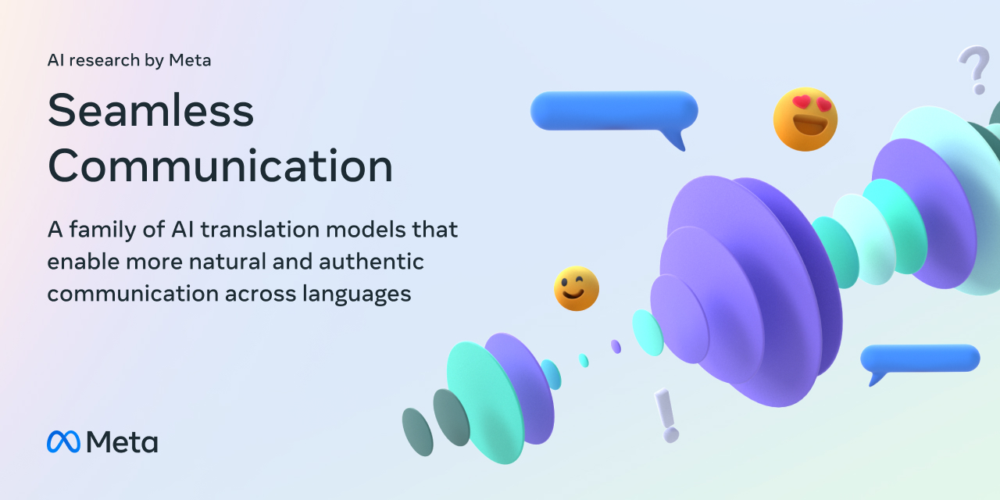

# Seamless Intro
## SeamlessM4T
SeamlessM4T is our foundational all-in-one **M**assively **M**ultilingual and **M**ultimodal **M**achine **T**ranslation model delivering high-quality translation for speech and text in nearly 100 languages.

SeamlessM4T models support the tasks of:
- Speech-to-speech translation (S2ST)
- Speech-to-text translation (S2TT)
- Text-to-speech translation (T2ST)
- Text-to-text translation (T2TT)
- Automatic speech recognition (ASR)

:star2: We are releasing SeamlessM4T v2, an updated version with our novel *UnitY2* architecture. This new model improves over SeamlessM4T v1 in quality as well as inference latency in speech generation tasks.

To learn more about the collection of SeamlessM4T models, the approach used in each, their language coverage and their performance, visit the [SeamlessM4T README](docs/m4t/README.md) or [🤗 Model Card](https://huggingface.co/facebook/seamless-m4t-v2-large)

## SeamlessExpressive

SeamlessExpressive is a speech-to-speech translation model that captures certain underexplored aspects of prosody such as speech rate and pauses, while preserving the style of one's voice and high content translation quality.

To learn more about SeamlessExpressive models, visit the [SeamlessExpressive README](docs/expressive/README.md) or [🤗 Model Card](https://huggingface.co/facebook/seamless-expressive)


## SeamlessStreaming

SeamlessStreaming is a streaming translation model. The model supports speech as input modality and speech/text as output modalities.

The SeamlessStreaming model supports the following tasks:
- Speech-to-speech translation (S2ST)
- Speech-to-text translation (S2TT)
- Automatic speech recognition (ASR)

To learn more about SeamlessStreaming models, visit the [SeamlessStreaming README](docs/streaming/README.md) or [🤗 Model Card](https://huggingface.co/facebook/seamless-streaming)

## Seamless

The Seamless model is the unified model for expressive streaming speech-to-speech translations.

## Links
### Blog
[AI at Meta Blog](https://ai.meta.com/research/seamless-communication/)
### Papers
[Seamless](https://ai.facebook.com/research/publications/seamless-multilingual-expressive-and-streaming-speech-translation/)

[EMMA](https://ai.meta.com/research/publications/efficient-monotonic-multihead-attention/)

[SONAR](https://ai.meta.com/research/publications/sonar-expressive-zero-shot-expressive-speech-to-speech-translation/)


### Demos

|                        | SeamlessM4T v2                                                                                                                        | SeamlessExpressive                                                                                                                               | SeamlessStreaming                                                                      |
| ---------------------- | ------------------------------------------------------------------------------------------------------------------------------------- | ------------------------------------------------------------------------------------------------------------------------------------------------ | -------------------------------------------------------------------------------------- |
| Demo                   | [SeamlessM4T v2 Demo](https://seamless.metademolab.com/m4t?utm_source=github&utm_medium=web&utm_campaign=seamless&utm_content=readme) | [SeamlessExpressive Demo](https://seamless.metademolab.com/expressive?utm_source=github&utm_medium=web&utm_campaign=seamless&utm_content=readme) |                                                                                          |
| HuggingFace Space Demo | [🤗 SeamlessM4T v2 Space](https://huggingface.co/spaces/facebook/seamless-m4t-v2-large)                                                | [🤗 SeamlessExpressive Space](https://huggingface.co/spaces/facebook/seamless-expressive)                                                         | [🤗 SeamlessStreaming Space](https://huggingface.co/spaces/facebook/seamless-streaming) |

## What's new


# Quick Start
## Installation
> [!NOTE]
> One of the prerequisites is [fairseq2](https://github.com/facebookresearch/fairseq2) which has pre-built packages available only
> for Linux x84-86 and Apple-silicon Mac computers. In addition it has a dependency on [libsndfile](https://github.com/libsndfile/libsndfile) which
> might not be installed on your machine. If you experience any installation issues, please refer to its
> [README](https://github.com/facebookresearch/fairseq2) for further instructions.

```
pip install .
```

> [!NOTE]
> Transcribing inference audio for computing metric uses [Whisper](https://github.com/openai/whisper#setup), which is automatically installed. Whisper in turn requires the command-line tool [`ffmpeg`](https://ffmpeg.org/) to be installed on your system, which is available from most package managers.


## Running inference

### SeamlessM4T Inference
Here’s an example of using the CLI from the root directory to run inference.

S2ST task:
```bash
m4t_predict <path_to_input_audio> --task s2st --tgt_lang <tgt_lang> --output_path <path_to_save_audio>
```
T2TT task:
```bash
m4t_predict <input_text> --task t2tt --tgt_lang <tgt_lang> --src_lang <src_lang>
```
Please refer to the [inference README](src/seamless_communication/cli/m4t/predict) for detailed instruction on how to run inference and the list of supported languages on the source, target sides for speech, text modalities.

For running S2TT/ASR natively (without Python) using GGML, please refer to [the unity.cpp section](#unitycpp).

### SeamlessExpressive Inference
> [!NOTE]
> Please check the [section](#seamlessexpressive-models) on how to download the model.

Below is the script for efficient batched inference.

```bash
export MODEL_DIR="/path/to/SeamlessExpressive/model"
export TEST_SET_TSV="input.tsv" # Your dataset in a TSV file, with headers "id", "audio"
export TGT_LANG="spa" # Target language to translate into, options including "fra", "deu", "eng" ("cmn" and "ita" are experimental)
export OUTPUT_DIR="tmp/" # Output directory for generated text/unit/waveform
export TGT_TEXT_COL="tgt_text" # The column in your ${TEST_SET_TSV} for reference target text to calcuate BLEU score. You can skip this argument.
export DFACTOR="1.0" # Duration factor for model inference to tune predicted duration (preddur=DFACTOR*preddur) per each position which affects output speech rate. Greater value means slower speech rate (default to 1.0). See expressive evaluation README for details on duration factor we used.
python src/seamless_communication/cli/expressivity/evaluate/pretssel_inference.py \
  ${TEST_SET_TSV} --gated-model-dir ${MODEL_DIR} --task s2st --tgt_lang ${TGT_LANG}\
  --audio_root_dir "" --output_path ${OUTPUT_DIR} --ref_field ${TGT_TEXT_COL} \
  --model_name seamless_expressivity --vocoder_name vocoder_pretssel \
  --text_unk_blocking True --duration_factor ${DFACTOR}
```

### SeamlessStreaming and Seamless Inference

[Streaming Evaluation README](src/seamless_communication/cli/streaming) has detailed instructions for running evaluations for the SeamlessStreaming and Seamless models. The CLI has an `--no-scoring` option that can be used to skip the scoring part and just run inference.


## Running SeamlessStreaming Demo
You can duplicate the [SeamlessStreaming HF space](https://huggingface.co/spaces/facebook/seamless-streaming?duplicate=true) to run the streaming demo.


You can also run the demo locally, by cloning the space from [here](https://huggingface.co/spaces/facebook/seamless-streaming/tree/main). See the [README](https://huggingface.co/spaces/facebook/seamless-streaming/blob/main/README.md) of the SeamlessStreaming HF repo for more details on installation.

## Running SeamlessM4T & SeamlessExpressive [Gradio](https://github.com/gradio-app/gradio) demos locally

To launch the same space demo we host on HuggingFace locally,

```bash
cd demo
pip install -r requirements.txt
python app.py
```

# Resources and usage
## Model
### SeamlessM4T models
| Model Name              | #params | checkpoint                                                                                                                                                                     | metrics                                                                             |
| ----------------------- | ------- | ------------------------------------------------------------------------------------------------------------------------------------------------------------------------------ | ----------------------------------------------------------------------------------- |
| SeamlessM4T-Large v2    | 2.3B    | [🤗 Model card](https://huggingface.co/facebook/seamless-m4t-v2-large) - [checkpoint](https://huggingface.co/facebook/seamless-m4t-v2-large/resolve/main/seamlessM4T_v2_large.pt  )                   | [metrics](https://dl.fbaipublicfiles.com/seamless/metrics/seamlessM4T_large_v2.zip) |
| SeamlessM4T-Large (v1)  | 2.3B    | [🤗 Model card](https://huggingface.co/facebook/seamless-m4t-large) - [checkpoint](https://huggingface.co/facebook/seamless-m4t-large/resolve/main/multitask_unity_large.pt)    | [metrics](https://dl.fbaipublicfiles.com/seamless/metrics/seamlessM4T_large.zip)    |
| SeamlessM4T-Medium (v1) | 1.2B    | [🤗 Model card](https://huggingface.co/facebook/seamless-m4t-medium) - [checkpoint](https://huggingface.co/facebook/seamless-m4t-medium/resolve/main/multitask_unity_medium.pt) | [metrics](https://dl.fbaipublicfiles.com/seamless/metrics/seamlessM4T_medium.zip)   |

### SeamlessExpressive models

[🤗 Model card](https://huggingface.co/facebook/seamless-expressive)

To access and download SeamlessExpressive, please request the model artifacts through [this request form](https://ai.meta.com/resources/models-and-libraries/seamless-downloads/). Upon approval, you will then receive an email with download links to each model artifact.

Please note that SeamlessExpressive is made available under its own [License](SEAMLESS_LICENSE) and [Acceptable Use Policy](ACCEPTABLE_USE_POLICY).

### SeamlessStreaming models
| Model Name        | #params | checkpoint                                                                                                                                                                                                                                                                                              | metrics                                                                                     |
| ----------------- | ------- | ------------------------------------------------------------------------------------------------------------------------------------------------------------------------------------------------------------------------------------------------------------------------------------------------------- | ------------------------------------------------------------------------------------------- |
| SeamlessStreaming | 2.5B    | [🤗 Model card](https://huggingface.co/facebook/seamless-streaming) - [monotonic decoder checkpoint](https://huggingface.co/facebook/seamless-streaming/resolve/main/seamless_streaming_monotonic_decoder.pt) - [streaming UnitY2 checkpoint](https://huggingface.co/facebook/seamless-streaming/resolve/main/seamless_streaming_unity.pt) | [metrics](https://dl.fbaipublicfiles.com/seamless/metrics/streaming/seamless_streaming.zip) |

### Seamless models
Seamless model is simply the SeamlessStreaming model with the non-expressive `vocoder_v2` swapped out with the expressive `vocoder_pretssel`.
Please check out above [section](#seamlessexpressive-models) on how to acquire `vocoder_pretssel` checkpoint.

## Evaluation

### SeamlessM4T Evaluation
To reproduce our results, or to evaluate using the same metrics over your own test sets, please check out the [README here](src/seamless_communication/cli/m4t/evaluate).
### SeamlessExpressive Evaluation
Please check out this [README section](docs/expressive/README.md#automatic-evaluation)

### SeamlessStreaming and Seamless Evaluation

[Streaming Evaluation README](src/seamless_communication/cli/streaming) has detailed instructions for running evaluations on the SeamlessStreaming and Seamless models.

## Unity.cpp
To enable Seamless Communication Everywhere, we implemented unity.cpp so users could run SeamlessM4T models in GGML - a C tensor library allowing easier integration on verbose platforms.

To transcribe/translte a given audio,

```
./ggml/bin/unity --model seamlessM4T_medium.ggml input.wav
```

For details of build and more usage please checkout [unity.cpp](ggml)

## Expressive Datasets

We created two expressive speech-to-speech translation datasets, mExpresso and mDRAL, between English and five other languages -- French, German, Italian, Mandarin and Spanish. We currently open source the speech-to-text of mExpresso for out-of-English directions, and we will open source the remaining part of the datasets soon. For details, please checkout [README](docs/expressive/README.md#benchmark-datasets)

### SeamlessAlignExpressive
We’re introducing the first expressive speech alignment procedure. Starting with raw data, the expressive alignment procedure automatically discovers pairs of audio segments sharing not only the same meaning, but the same overall expressivity. To showcase this procedure, we are making metadata available to create a benchmarking dataset called SeamlessAlignExpressive, that can be used to validate the quality of our alignment method. SeamlessAlignExpressive is the first large-scale (11k+ hours) collection of multilingual audio alignments for expressive translation. More details can be found on the [SeamlessAlignExpressive README](docs/expressive/seamless_align_expressive_README.md).


## Converting raw audio to units
Please check out the [README here](src/seamless_communication/cli/m4t/audio_to_units). Note that SeamlessM4T v1 model uses reduced units and other models use non-reduced units.

# Libraries

Seamless Communication depends on 4 libraries developed by Meta.

## [fairseq2](https://github.com/facebookresearch/fairseq2)
fairseq2 is our next-generation open-source library of sequence modeling components that provides researchers and developers with building blocks for machine translation, language modeling, and other sequence generation tasks. All SeamlessM4T models in this repository are powered by fairseq2.

## [SONAR and BLASER 2.0](https://github.com/facebookresearch/SONAR)
SONAR, Sentence-level multimOdal and laNguage-Agnostic Representations is a new multilingual and -modal sentence embedding space which outperforms existing sentence embeddings such as LASER3 and LabSE on the xsim and xsim++ multilingual similarity search tasks. SONAR provides text and speech encoders for many languages. SeamlessAlign was mined based on SONAR embeddings.

BLASER 2.0 is our latest model-based evaluation metric for multimodal translation. It is an extension of BLASER, supporting both speech and text. It operates directly on the source signal, and as such, does not require any intermediate ASR system like ASR-BLEU. As in the first version, BLASER 2.0 leverages the similarity between input and output sentence embeddings. SONAR is the underlying embedding space for BLASER 2.0. Scripts to run evaluation with BLASER 2.0 can be found in the [SONAR repo](https://github.com/facebookresearch/SONAR).

## [stopes](https://github.com/facebookresearch/stopes)
As part of the seamless communication project, we've extended the stopes library. Version 1 provided a text-to-text mining tool to build training dataset for translation models. Version 2 has been extended thanks to SONAR, to support tasks around training large speech translation models. In particular, we provide tools to read/write the fairseq audiozip datasets and a new mining pipeline that can do speech-to-speech, text-to-speech, speech-to-text and text-to-text mining, all based on the new SONAR embedding space.

## [SimulEval](https://github.com/facebookresearch/SimulEval)
SimulEval is a library used for evaluating simulaneous translation models. SimulEval also provides a backend for generation using partial/incremental inputs with flexible/extensible states, which is used to implement streaming inference. Users define agents which implement SimulEval's interface, which can be connected together in a pipeline. You can find agents implemented for SeamlessStreaming [here](src/seamless_communication/streaming/agents).

## [Legacy] SeamlessM4T v1 instructions
#### Finetuning SeamlessM4T v1 models
Please check out the [README here](src/seamless_communication/cli/m4t/finetune).

#### On-device models
Apart from Seamless-M4T large (2.3B) and medium (1.2B) models, we are also releasing a small model (281M) targeted for on-device inference. To learn more about the usage and model details check out the [README here](docs/m4t/on_device_README.md).

#### SeamlessAlign mined dataset
We open-source the metadata to SeamlessAlign, the largest open dataset for multimodal translation, totaling 270k+ hours of aligned Speech and Text data. The dataset can be rebuilt by the community based on the [SeamlessAlign readme](docs/m4t/seamless_align_README.md).


# Citation
If you use Seamless in your work or any models/datasets/artifacts published in Seamless, please cite :

```bibtex
@inproceedings{seamless2023,
   title="Seamless: Multilingual Expressive and Streaming Speech Translation",
   author="{Seamless Communication}, Lo{\"i}c Barrault, Yu-An Chung, Mariano Coria Meglioli, David Dale, Ning Dong, Mark Duppenthaler, Paul-Ambroise Duquenne, Brian Ellis, Hady Elsahar, Justin Haaheim, John Hoffman, Min-Jae Hwang, Hirofumi Inaguma, Christopher Klaiber, Ilia Kulikov, Pengwei Li, Daniel Licht, Jean Maillard, Ruslan Mavlyutov, Alice Rakotoarison, Kaushik Ram Sadagopan, Abinesh Ramakrishnan, Tuan Tran, Guillaume Wenzek, Yilin Yang, Ethan Ye, Ivan Evtimov, Pierre Fernandez, Cynthia Gao, Prangthip Hansanti, Elahe Kalbassi, Amanda Kallet, Artyom Kozhevnikov, Gabriel Mejia, Robin San Roman, Christophe Touret, Corinne Wong, Carleigh Wood, Bokai Yu, Pierre Andrews, Can Balioglu, Peng-Jen Chen, Marta R. Costa-juss{\`a}, Maha Elbayad, Hongyu Gong, Francisco Guzm{\'a}n, Kevin Heffernan, Somya Jain, Justine Kao, Ann Lee, Xutai Ma, Alex Mourachko, Benjamin Peloquin, Juan Pino, Sravya Popuri, Christophe Ropers, Safiyyah Saleem, Holger Schwenk, Anna Sun, Paden Tomasello, Changhan Wang, Jeff Wang, Skyler Wang, Mary Williamson",
  journal={ArXiv},
  year={2023}
}
```

# License

We have three license categories.

The following non-generative components are MIT licensed as found in [MIT_LICENSE](MIT_LICENSE):
- Code
- Text only part of the mExpresso dataset found in the [SeamlessExpressive README](docs/expressive/README.md).
- UnitY2 forced alignment extractor found in the [UnitY2 Aligner README](docs/m4t/unity2_aligner_README.md).
- Speech toxicity tool with the etox dataset found in the [Toxicity README](src/seamless_communication/cli/toxicity).

The following models are CC-BY-NC 4.0 licensed as found in the [LICENSE](LICENSE):
- SeamlessM4T models (v1 and v2).
- SeamlessStreaming models.

The following models are Seamless licensed as found in [SEAMLESS_LICENSE](SEAMLESS_LICENSE):
- Seamless models.
- SeamlessExpressive models.
