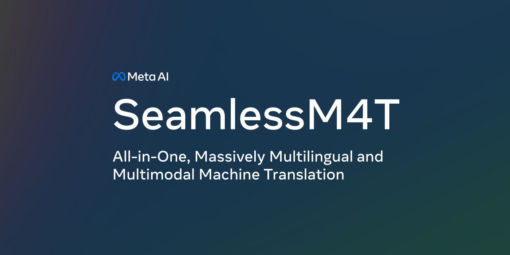

# SeamlessM4T
SeamlessM4T is designed to provide high quality translation, allowing people from different linguistic communities to communicate effortlessly through speech and text. 

SeamlessM4T covers:
- 📥 101 languages for speech input
- ⌨️   96 Languages for text input/output
- 🗣️  35 languages for speech output. 

This unified model enables multiple tasks without relying on multiple separate models:
- Speech-to-speech translation (S2ST)
- Speech-to-text translation (S2TT)
- Text-to-speech translation (T2ST)
- Text-to-text translation (T2TT)
- Automatic speech recognition (ASR)

Links: 
- [Blog](https://ai.meta.com/blog/seamless-m4t) 
- [Paper]() 
- [Demo]() 
- [Huggingface space]()

# Quick Start  
## Installation 

```
pip install .
```

## Running inference 

Here’s an example of using the CLI from the root directory to run inference. 

S2ST task:
```bash
python scripts/m4t/predict/predict.py <path_to_input_audio> s2st <tgt_lang> --output_path <path_to_save_audio>
```
T2TT task:
```bash
python scripts/m4t/predict/predict.py <input_text> t2tt <tgt_lang> --src_lang <src_lang>
```

Please refer to the [evaluation README](scripts/m4t/predict) for detailed instruction on how to run inference.

# Libraries

Seamless Communication depends on 3 libraries developed by Meta. 

## [fairseq2](https://github.com/facebookresearch/fairseq2)
fairseq2 is our next-generation open-source library of sequence modeling components that provides researchers and developers with building blocks for machine translation, language modeling, and other sequence generation tasks. All SeamlessM4T models in this repository are powered by fairseq2.

## [stopes](https://github.com/facebookresearch/stopes) 
As part of the seamless communication project, we've extended the stopes library. Version 1 provided a text-text mining tool to build training dataset for translation models. Version 2 has been extended thanks to SONAR to support tasks around training large speech translation models. In particular, we provide tools to read/write the fairseq audiozip datasets and a new mining pipeline that can do speech-speech, text-speech, speech-text and text-text mining, all based on the new SONAR embedding space.

## [BLASER 2.0](https://github.com/facebookresearch/SONAR)
BLASER 2.0 is our latest model-based evaluation metric for multimodal translation. It is an extension of BLASER, supporting both speech and text. It operates directly on the source signal, and as such, does not require any intermediate ASR sytem like ASR-BLEU. As in the first version, BLASER 2.0 leverages the similarity between input and output sentence embeddings. SONAR is the underlying embedding space for BLASER 2.0. Scripts to run evaluation with BLASER 2.0 can be found in the [SONAR repo](https://github.com/facebookresearch/SONAR)


# Resources and usage
## SeamlessM4T models
| Model Name | #params | checkpoint | metrics |
| - | - | - | - |
| SeamlessM4T-Large | 2.3B |[model](https://dl.fbaipublicfiles.com/seamless_aug/models/large_unity/multitask_unity_large.pt) | [metrics](https://dl.fbaipublicfiles.com/seamless_aug/metrics/SeamlessM4t_Large.zip) |
| SeamlessM4T-Medium | 1.2B |[model](https://dl.fbaipublicfiles.com/seamless_aug/models/medium_unity/multitask_unity_medium.pt) | [metrics](https://dl.fbaipublicfiles.com/seamless_aug/metrics/SeamlessM4t_Medium.zip) |

We provide the extensive evaluation results of seamlessM4T-Large and SeamlessM4T-Medium reported in the paper (as averages) in the `metrics` files above.

## Evaluating SeamlessM4T models 
To reproduce our results, or to evaluate using the same metrics over your own test sets, please check out [README here](https://github.com/fairinternal/seamless_communication/blob/main/docs/m4t/eval_README.md).

## Finetuning SeamlessM4T models 

TODO

## On-device models 
Apart from Seamless-M4T large (2.3B) and medium (1.2B) models, we are also releasing a small model (281M) targeted for on-device inference. To learn more about the usage and model details check out [README here](https://github.com/fairinternal/seamless_communication/blob/main/docs/m4t/on_device_README.md)

# Citation
If you use SeamlessM4T in your work or any models/datasets/artifacts published in SeamlessM4T, please cite :

```bibtex
@article{seamlessm4t2023,
  title={SeamlessM4T—Massively Multilingual \& Multimodal Machine Translation},
  author={{Seamless Communication}, Lo\"{i}c Barrault, Yu-An Chung, Mariano Cora Meglioli, David Dale, Ning Dong, Paul-Ambroise Duquenne, Hady Elsahar, Hongyu Gong, Kevin Heffernan, John Hoffman, Christopher Klaiber, Pengwei Li, Daniel Licht, Jean Maillard, Alice Rakotoarison, Kaushik Ram Sadagopan, Guillaume Wenzek, Ethan Ye,  Bapi Akula, Peng-Jen Chen, Naji El Hachem, Brian Ellis, Gabriel Mejia Gonzalez, Justin Haaheim, Prangthip Hansanti, Russ Howes, Bernie Huang, Min-Jae Hwang, Hirofumi Inaguma, Somya Jain, Elahe Kalbassi, Amanda Kallet, Ilia Kulikov, Janice Lam, Daniel Li, Xutai Ma, Ruslan Mavlyutov, Benjamin Peloquin, Mohamed Ramadan, Abinesh Ramakrishnan, Anna Sun, Kevin Tran, Tuan Tran, Igor Tufanov, Vish Vogeti, Carleigh Wood, Yilin Yang, Bokai Yu, Pierre Andrews, Can Balioglu, Marta R. Costa-juss\`{a} \footnotemark[3], Onur \,{C}elebi,Maha Elbayad,Cynthia Gao, Francisco Guzm\'an, Justine Kao, Ann Lee, Alexandre Mourachko, Juan Pino, Sravya Popuri, Christophe Ropers, Safiyyah Saleem, Holger Schwenk, Paden Tomasello, Changhan Wang, Jeff Wang, Skyler Wang},
  journal={ArXiv},
  year={2023}
}
```
# License

seamless_communication is CC-BY-NC 4.0 licensed, as found in LICENSE file
