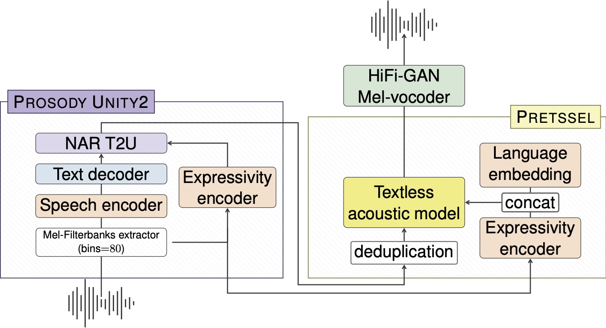

# SeamlessExpressive

SeamlessExpressive model consists of two main modules: (1) Prosody UnitY2, which is a prosody-aware speech-to-unit translation model based on UnitY2 architecture; and (2) PRETSSEL, which is a unit-to-speech model featuring cross-lingual expressivity preservation.




## Prosody UnitY2

Prosody UnitY2 is an expressive speech-to-unit translation model, injecting expressivity embedding from PRETSSEL into the unit generation. It could transfer phrase-level prosody such as speech rate or pauses.


## PRETSSEL

**P**aralinguistic **RE**presentation-based
**T**extle**SS** acoustic mod**EL** (PRETSSEL) is an expressive unit-to-speech generator, and it can efficiently disentangle semantic and expressivity components from speech. It transfers utterance-level expressivity like the style of one's voice.

# Benchmark Datasets

## mExpresso (Multilingual Expresso)

mExpresso is an expressive S2ST dataset that includes seven styles of read speech (i.e., default, happy, sad, confused, enunciated, whisper and laughing) between English and five other languages -- French, German, Italian, Mandarin and Spanish. We create the dataset by expanding a subset of read speech in [Expresso Dataset](https://github.com/facebookresearch/textlesslib/tree/main/examples/expresso/dataset). We first translate the English transcriptions into other languages, including the emphasis markers in the transcription, and then the gender matched bilingual speakers read the translation in the style suggested by the markers.

We are currently open source the text translation of the other language to enable evaluating English to other directions. We will open source the audio files in the near future. 

Text translation in other languages can be [Downloaded](https://dl.fbaipublicfiles.com/seamless/datasets/mexpresso_text/mexpresso_text.tar).

### Statistics of mExpresso
| language pair | subset | # items | English duration (hr) | # speakers |
|---------------|--------|---------|-----------------------|------------|
|eng-cmn| dev | 2369 | 2.1 | 1 |
| | test | 5003 | 4.8 | 2 |
|eng-deu| dev | 4420 | 3.9 | 2 |
| | test | 5733 | 5.6 | 2 |
|eng-fra| dev | 4770 | 4.2 | 2 |
| | test | 5742 | 5.6 | 2 |
|eng-ita| dev | 4413 | 3.9 | 2 |
| | test | 5756 | 5.7 | 2 |
|eng-spa| dev | 4758 | 4.2 | 2 |
| | test | 5693 | 5.5 | 2 |

### Create mExpresso S2T dataset by downloading and combining with English Expresso
Run the following command to create English to other langauges speech-to-text dataset from scratch. It will first download the English Expresso dataset, downsample the audio to 16k Hz, and join with the text translation to form the manifest.

```python
python3 -m seamless_communication.cli.expressivity.data.prepare_mexpresso \
    <OUTPUT_FOLDER>
```

The output manifest will be located at `<OUTPUT_FOLDER>/{dev,test}_mexpresso_eng_{spa,fra,deu,ita,cmn}.tsv`


# Automatic evaluation

Python package dependencies (on top of seamless_communication, coming from stopes pipelines):
* Unidecode
* scipy
* phonemizer
* s3prl
* syllables
* ipapy
* pkuseg
* nltk
* fire
* inflect

```bash
pip install Unidecode scipy phonemizer s3prl syllables ipapy pkuseg nltk fire inflect
```

As described in Section 4.3 we use following automatic metrics:

1. **ASR-BLEU**: refer to `/src/seamless_communication/cli/eval_utils` to see how the OpenAI whisper ASR model is used to extract transcriptions from generated audios.

2. **Vocal Style Similarity**: refer to [stopes/eval/vocal_style_similarity](https://github.com/facebookresearch/stopes/tree/main/stopes/eval/vocal_style_similarity) for implementation details.

3. **AutoPCP**: refer to [stopes/eval/auto_pcp](https://github.com/facebookresearch/stopes/tree/main/stopes/eval/auto_pcp) for implementation details.

4. **Pause and Rate scores**: refer to [stopes/eval/local_prosody](https://github.com/facebookresearch/stopes/tree/main/stopes/eval/local_prosody) for implementation details. Rate score corresponds to the syllable speech rate spearman correlation between source and predicted speech. Pause score corresponds to the weighted mean joint score produced by `stopes/eval/local_prosody/compare_utterances.py` script from stopes repo.

## Evaluation results: mExpresso

Please see [mExpresso section](#mexpresso-multilingual-expresso) on how to download evaluation data

*Important Notes*:

* We used empirically chosen duration factors per each tgt language towards the best perceptual quality: 1.0 (default) for cmn, spa, ita; 1.1 for deu; 1.2 for fra. Same settings were used to report results in the "Seamless: Multilingual Expressive and Streaming Speech Translation" paper.

* Results here slightly differs from ones shown in the paper due to several descrepancies in the pipeline: results reported here use pipeline w/ fairseq2 backend for model's inference and pipeline includes watermarking.

| Language | Partition | ASR-BLEU | Vocal Style Sim | AutoPCP | Pause | Rate |
|----------|-----------|----------|-------------|---------|-------|------|
| eng_cmn | dev | 26.080 | 0.207 | 3.168 | 0.236 | 0.538 |
| eng_deu | dev | 36.940 | 0.261 | 3.298 | 0.319 | 0.717 |
| eng_fra | dev | 37.780 | 0.231 | 3.285 | 0.331 | 0.682 |
| eng_ita | dev | 40.170 | 0.226 | 3.322 | 0.388 | 0.734 |
| eng_spa | dev | 42.400 | 0.228 | 3.379 | 0.332 | 0.702 |
| eng_cmn | test | 23.320 | 0.249 | 2.984 | 0.385 | 0.522 |
| eng_deu | test | 27.780 | 0.290 | 3.117 | 0.483 | 0.717 |
| eng_fra | test | 38.360 | 0.270 | 3.117 | 0.506 | 0.663 |
| eng_ita | test | 38.020 | 0.274 | 3.130 | 0.523 | 0.686 |
| eng_spa | test | 42.920 | 0.274 | 3.183 | 0.508 | 0.675 |
### Step-by-step evaluation

Pre-requisite: all steps described here assume that the generation/inference has been completed following [steps](../../README.md#seamlessexpressive-inference).

For stopes installation please refer to [stopes/eval](https://github.com/facebookresearch/stopes/tree/main/stopes/eval).

The resulting directory of generated outputs:
```bash
export SPLIT="dev_mexpresso_eng_spa" # example, change for your split
export TGT_LANG="spa"
export SRC_LANG="eng"
export GENERATED_DIR="path_to_generated_output_for_given_data_split"
export GENERATED_TSV="generate-${SPLIT}.tsv"
export STOPES_ROOT="path_to_stopes_code_repo"
export SC_ROOT="path_to_this_repo"
```

**ASR-BLEU evaluation**

```bash
python ${SC_ROOT}/src/seamless_communication/cli/expressivity/evaluate/run_asr_bleu.py \
    --generation_dir_path=${GENERATED_DIR} \
    --generate_tsv_filename=generate-${SPLIT}.tsv \
    --tgt_lang=${TGT_LANG}
```
* `generate-${SPLIT}.tsv` is an expected output from inference described in pre-requisite

After completion resulting ASR-BLEU score is written in `${GENERATED_DIR}/s2st_asr_bleu_normalized.json`.

**Vocal Style Similarity**

Download & set WavLM finetuned ckpt path (`${SPEECH_ENCODER_MODEL_PATH}`) as described in [stopes README](https://github.com/facebookresearch/stopes/tree/main/stopes/eval/vocal_style_similarity#pre-requisites) to reproduce our vocal style similarity eval.

```bash
python -m stopes.modules +vocal_style_similarity=base \
    launcher.cluster=local \
    vocal_style_similarity.model_type=valle \
    +vocal_style_similarity.model_path=${SPEECH_ENCODER_MODEL_PATH} \
    +vocal_style_similarity.input_file=${GENERATED_DIR}/${GENERATED_TSV} \
    +vocal_style_similarity.output_file=${GENERATED_DIR}/vocal_style_sim_result.txt \
    vocal_style_similarity.named_columns=true \
    vocal_style_similarity.src_audio_column=src_audio \
    vocal_style_similarity.tgt_audio_column=hypo_audio
```
* We report average number from all utterance scores written in `${GENERATED_DIR}/vocal_style_sim_result.txt`.

**AutoPCP**

```bash
python -m stopes.modules +compare_audios=AutoPCP_multilingual_v2 \
    launcher.cluster=local \
    +compare_audios.input_file=${GENERATED_DIR}/${GENERATED_TSV} \
    compare_audios.src_audio_column=src_audio \
    compare_audios.tgt_audio_column=hypo_audio \
    +compare_audios.named_columns=true \
    +compare_audios.output_file=${GENERATED_DIR}/autopcp_result.txt
```
* We report average number from all utterance scores written in `${GENERATED_DIR}/autopcp_result.txt`.

**Pause and Rate**

This stage includes 3 steps: (1) src lang annotation, (2) tgt lang annotation, (3) pairwise comparison

```bash
# src lang pause&rate annotation
python ${STOPES_ROOT}/stopes/eval/local_prosody/annotate_utterances.py \
    +data_path=${GENERATED_DIR}/${GENERATED_TSV} \
    +result_path=${GENERATED_DIR}/${SRC_LANG}_speech_rate_pause_annotation.tsv \
    +audio_column=src_audio \
    +text_column=src_text \
    +speech_units=[syllable] \
    +vad=true \
    +net=true \
    +lang=$SRC_LANG \
    +forced_aligner=fairseq2_nar_t2u_aligner

# tgt lang pause&rate annotation
python ${STOPES_ROOT}/stopes/eval/local_prosody/annotate_utterances.py \
    +data_path=${GENERATED_DIR}/${GENERATED_TSV} \
    +result_path=${GENERATED_DIR}/${TGT_LANG}_speech_rate_pause_annotation.tsv \
    +audio_column=hypo_audio \
    +text_column=s2t_out \
    +speech_units=[syllable] \
    +vad=true \
    +net=true \
    +lang=$TGT_LANG \
    +forced_aligner=fairseq2_nar_t2u_aligner

# pair wise comparison
python ${STOPES_ROOT}/stopes/eval/local_prosody/compare_utterances.py \
    +src_path=${GENERATED_DIR}/${SRC_LANG}_speech_rate_pause_annotation.tsv \
    +tgt_path=${GENERATED_DIR}/${TGT_LANG}_speech_rate_pause_annotation.tsv \
    +result_path=${GENERATED_DIR}/${SRC_LANG}_${TGT_LANG}_pause_scores.tsv \
    +pause_min_duration=0.1
```

* For Rate reporting, please see the aggregation function `get_rate` in `${SC_ROOT}/src/seamless_communication/cli/expressivity/evaluate/post_process_pauserate.py`;
* For Pause reporting, please see the aggregation function `get_pause` in `${SC_ROOT}/src/seamless_communication/cli/expressivity/evaluate/post_process_pauserate.py`.
