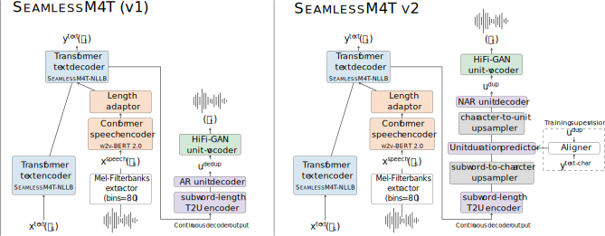

# SeamlessM4T
SeamlessM4T is our foundational all-in-one **M**assively **M**ultilingual and **M**ultimodal **M**achine **T**ranslation model delivering high-quality translation for speech and text in nearly 100 languages.

SeamlessM4T models support:
- :microphone: 101 languages for speech input.
- :speech_balloon: 96 Languages for text input/output.
- :speaker: 35 languages for speech output.

This unified model enables multiple tasks without relying on multiple separate models:
- Speech-to-speech translation (S2ST)
- Speech-to-text translation (S2TT)
- Text-to-speech translation (T2ST)
- Text-to-text translation (T2TT)
- Automatic speech recognition (ASR).

> [!NOTE]
> SeamlessM4T v2 and v1 are also supported in the 🤗 Transformers library, more on it [in the dedicated section below](#transformers-usage).

## SeamlessM4T v1
The v1 version of SeamlessM4T is a multitask adaptation of the *UnitY* architecture [(Inaguma et al., 2023)](https://aclanthology.org/2023.acl-long.872/).
*UnitY* is a two-pass direct S2ST architecture which first generates textual representations and subsequently predicts discrete acoustic units.


## SeamlessM4T v2
The v2 version of SeamlessM4T is a multitask adaptation of our novel *UnitY2* architecture.
*Unity2* with its hierarchical character-to-unit upsampling and non-autoregressive text-to-unit decoding considerably improves over SeamlessM4T v1 in quality and inference speed.



## SeamlessM4T  models
| Model Name         | #params | checkpoint                                                                              | metrics                                                                              |
| ------------------ | ------- | --------------------------------------------------------------------------------------- | ------------------------------------------------------------------------------------ |
| SeamlessM4T-Large v2  | 2.3B    | [🤗 Model card](https://huggingface.co/facebook/seamless-m4t-v2-large) - [checkpoint](https://huggingface.co/facebook/seamless-m4t-v2-large/resolve/main/seamlessM4T_v2_large.pt)   | [metrics](https://dl.fbaipublicfiles.com/seamless/metrics/seamlessM4T_large_v2.zip)  |
| SeamlessM4T-Large (v1) | 2.3B    | [🤗 Model card](https://huggingface.co/facebook/seamless-m4t-large) - [checkpoint](https://huggingface.co/facebook/seamless-m4t-large/resolve/main/multitask_unity_large.pt)   | [metrics](https://dl.fbaipublicfiles.com/seamless/metrics/seamlessM4T_large.zip)  |
| SeamlessM4T-Medium (v1) | 1.2B    | [🤗 Model card](https://huggingface.co/facebook/seamless-m4t-medium) - [checkpoint](https://huggingface.co/facebook/seamless-m4t-medium/resolve/main/multitask_unity_medium.pt) | [metrics](https://dl.fbaipublicfiles.com/seamless/metrics/seamlessM4T_medium.zip) |

We provide the extensive evaluation results of seamlessM4T-Large and SeamlessM4T-Medium reported in the paper (as averages) in the `metrics` files above.

The evaluation data ids for FLEURS, CoVoST2 and CVSS-C can be found [here](https://dl.fbaipublicfiles.com/seamless/metrics/evaluation_data_ids.zip)


## Using SeamlessM4T models

### `m4t_predict` with CLI:
Inference is run with the CLI, from the root directory of the repository.

The model can be specified with `--model_name` `seamlessM4T_v2_large`, `seamlessM4T_large` or `seamlessM4T_medium`:

```bash
# S2ST:
m4t_predict <path_to_input_audio> --task s2st --tgt_lang <tgt_lang> --output_path <path_to_save_audio> --model_name seamlessM4T_v2_large

# S2T:
m4t_predict <path_to_input_audio> --task s2tt --tgt_lang <tgt_lang> --model_name seamlessM4T_v2_large

# T2TT:
m4t_predict <input_text> --task t2tt --tgt_lang <tgt_lang> --src_lang <src_lang> --model_name seamlessM4T_v2_large

# T2ST:
m4t_predict <input_text> --task t2st --tgt_lang <tgt_lang> --src_lang <src_lang> --output_path <path_to_save_audio> --model_name seamlessM4T_v2_large

# ASR:
m4t_predict <path_to_input_audio> --task asr --tgt_lang <tgt_lang> --model_name seamlessM4T_v2_large

```
### Inference with `Translator`:
Inference calls for the `Translator` object instantiated with a multitask UnitY or UnitY2 model with the options:
- [`seamlessM4T_v2_large`](https://huggingface.co/facebook/seamless-m4t-v2-large)
- [`seamlessM4T_large`](https://huggingface.co/facebook/seamless-m4t-large)
- [`seamlessM4T_medium`](https://huggingface.co/facebook/seamless-m4t-medium)

and a vocoder:
- `vocoder_v2` for `seamlessM4T_v2_large`.
- `vocoder_36langs` for `seamlessM4T_large` or `seamlessM4T_medium`.

```python
import torch
from seamless_communication.inference import Translator


# Initialize a Translator object with a multitask model, vocoder on the GPU.
translator = Translator("seamlessM4T_large", "vocoder_36langs", torch.device("cuda:0"), torch.float16)
```

Now `predict()` can be used to run inference as many times on any of the supported tasks.

Given an input audio with `<path_to_input_audio>` or an input text `<input_text>` in `<src_lang>`,
we first set the `text_generation_opts`, `unit_generation_opts` and then translate into `<tgt_lang>` as follows:

**S2ST and T2ST (speech output):**

```python
# S2ST
text_output, speech_output = translator.predict(
    input=<path_to_input_audio>,
    task_str="S2ST",
    tgt_lang=<tgt_lang>,
    text_generation_opts=text_generation_opts,
    unit_generation_opts=unit_generation_opts
)

# T2ST
text_output, speech_output = translator.predict(
    input=<input_text>,
    task_str="T2ST",
    tgt_lang=<tgt_lang>,
    src_lang=<src_lang>,
    text_generation_opts=text_generation_opts,
    unit_generation_opts=unit_generation_opts
)

```
Note that `<src_lang>` must be specified for T2ST.

The generated units are synthesized and the output audio file is saved with:

```python
# Save the translated audio output:
import torchaudio
torchaudio.save(
    <path_to_save_audio>,
    speech_output.audio_wavs[0][0].cpu(),
    sample_rate=speech_output.sample_rate,
)
```
**S2TT, T2TT and ASR (text output):**

```python
# S2TT
text_output, _ = translator.predict(
    input=<path_to_input_audio>,
    task_str="S2TT",
    tgt_lang=<tgt_lang>,
    text_generation_opts=text_generation_opts,
    unit_generation_opts=None
)

# ASR
# This is equivalent to S2TT with `<tgt_lang>=<src_lang>`.
    text_output, _ = translator.predict(
    input=<path_to_input_audio>,
    task_str="ASR",
    tgt_lang=<src_lang>,
    text_generation_opts=text_generation_opts,
    unit_generation_opts=None
)

# T2TT
text_output, _ = translator.predict(
    input=<input_text>,
    task_str="T2TT",
    tgt_lang=<tgt_lang>,
    src_lang=<src_lang>,
    text_generation_opts=text_generation_opts,
    unit_generation_opts=None
)

```
Note that `<src_lang>` must be specified for T2TT

To reproduce the seamless papers results ([v1](https://arxiv.org/abs/2308.11596) or [v2](https://arxiv.org/abs/2312.05187)), or to evaluate using the same metrics over your own test sets, please check out the [Evaluation README here](../../src/seamless_communication/cli/m4t/evaluate/README.md).

## Inference with 🤗 `Transformers`

SeamlessM4T is available in the 🤗 Transformers library, requiring minimal dependencies. Steps to get started:

1. First install the 🤗 [Transformers library](https://github.com/huggingface/transformers) from main and [sentencepiece](https://github.com/google/sentencepiece):

```
pip install git+https://github.com/huggingface/transformers.git sentencepiece
```

2. Run the following Python code to generate speech samples. Here the target language is Russian:

```py
import torchaudio
from transformers import AutoProcessor, SeamlessM4Tv2Model

processor = AutoProcessor.from_pretrained("facebook/seamless-m4t-v2-large")
model = SeamlessM4Tv2Model.from_pretrained("facebook/seamless-m4t-v2-large")

# from text
text_inputs = processor(text="Hello, my dog is cute", src_lang="eng", return_tensors="pt")
audio_array_from_text = model.generate(**text_inputs, tgt_lang="rus")[0].cpu().squeeze()

# from audio
audio, orig_freq = torchaudio.load("https://www2.cs.uic.edu/~i101/SoundFiles/preamble10.wav")
audio = torchaudio.functional.resample(audio, orig_freq=orig_freq, new_freq=16_000) # must be a 16 kHz waveform array
audio_inputs = processor(audios=audio, return_tensors="pt")
audio_array_from_audio = model.generate(**audio_inputs, tgt_lang="rus")[0].cpu().squeeze()
```

3. Listen to the audio samples either in an ipynb notebook:

```py
from IPython.display import Audio

sample_rate = model.config.sampling_rate
Audio(audio_array_from_text, rate=sample_rate)
Audio(audio_array_from_audio, rate=sample_rate)
```

Or save them as a `.wav` file using a third-party library, e.g. `torchaudio`:

```py
torchaudio.save(
    <path_to_save_audio>,
    audio_array_from_audio,  # or audio_array_from_text
    sample_rate=model.config.sampling_rate,
)
```
2.  (bis) To run inference for text generating tasks (T2TT, ASR or S2TT), it is recommended to use [dedicated models](https://huggingface.co/docs/transformers/main/en/model_doc/seamless_m4t_v2#1-use-dedicated-models). With that, only the required sub-modules will be loaded. For exmaple, text-to-text translation from English to Bulgarian, is performed as follows:
```py
from transformers import AutoProcessor, SeamlessM4Tv2ForTextToText
processor = AutoProcessor.from_pretrained("facebook/seamless-m4t-v2-large")
model = SeamlessM4Tv2ForTextToText.from_pretrained("facebook/seamless-m4t-v2-large")

src_lang, tgt_lang = "eng", "bul"
text_inputs = processor(text='Hello, my dog is cute', src_lang=src_lang, return_tensors="pt")
decoder_input_ids = model.generate(**text_inputs, tgt_lang=tgt_lang)[0].tolist()
translated_text = processor.decode(decoder_input_ids, skip_special_tokens=True)
print(f"{tgt_lang}: {translated_text}")

```

> [!NOTE]
> For more details on using the SeamlessM4T model for inference using the 🤗 Transformers library, refer to the
[SeamlessM4T v2 docs](https://huggingface.co/docs/transformers/main/en/model_doc/seamless_m4t_v2), the
[SeamlessM4T v1 docs](https://huggingface.co/docs/transformers/main/en/model_doc/seamless_m4t) or to this hands-on [Google Colab](https://colab.research.google.com/github/ylacombe/scripts_and_notebooks/blob/main/v2_seamless_m4t_hugging_face.ipynb).


## Finetuning SeamlessM4T models
Please check out the [Finetuning README here](../../src/seamless_communication/cli/m4t/finetune/README.md).

## Supported Languages:

Listed below, are the languages supported by SeamlessM4T-large (v1/v2).
The `source` column specifies whether a language is supported as source speech (`Sp`) and/or source text (`Tx`).
The `target` column specifies whether a language is supported as target speech (`Sp`) and/or target text (`Tx`).


| code | language               | script     | Source | Target |
| ---- | ---------------------- | ---------- | ------ | ------ |
| afr  | Afrikaans              | Latn       | Sp, Tx | Tx     |
| amh  | Amharic                | Ethi       | Sp, Tx | Tx     |
| arb  | Modern Standard Arabic | Arab       | Sp, Tx | Sp, Tx |
| ary  | Moroccan Arabic        | Arab       | Sp, Tx | Tx     |
| arz  | Egyptian Arabic        | Arab       | Sp, Tx | Tx     |
| asm  | Assamese               | Beng       | Sp, Tx | Tx     |
| ast  | Asturian               | Latn       | Sp     | \--    |
| azj  | North Azerbaijani      | Latn       | Sp, Tx | Tx     |
| bel  | Belarusian             | Cyrl       | Sp, Tx | Tx     |
| ben  | Bengali                | Beng       | Sp, Tx | Sp, Tx |
| bos  | Bosnian                | Latn       | Sp, Tx | Tx     |
| bul  | Bulgarian              | Cyrl       | Sp, Tx | Tx     |
| cat  | Catalan                | Latn       | Sp, Tx | Sp, Tx |
| ceb  | Cebuano                | Latn       | Sp, Tx | Tx     |
| ces  | Czech                  | Latn       | Sp, Tx | Sp, Tx |
| ckb  | Central Kurdish        | Arab       | Sp, Tx | Tx     |
| cmn  | Mandarin Chinese       | Hans       | Sp, Tx | Sp, Tx |
| cmn_Hant  | Mandarin Chinese  | Hant       | Sp, Tx | Sp, Tx |
| cym  | Welsh                  | Latn       | Sp, Tx | Sp, Tx |
| dan  | Danish                 | Latn       | Sp, Tx | Sp, Tx |
| deu  | German                 | Latn       | Sp, Tx | Sp, Tx |
| ell  | Greek                  | Grek       | Sp, Tx | Tx     |
| eng  | English                | Latn       | Sp, Tx | Sp, Tx |
| est  | Estonian               | Latn       | Sp, Tx | Sp, Tx |
| eus  | Basque                 | Latn       | Sp, Tx | Tx     |
| fin  | Finnish                | Latn       | Sp, Tx | Sp, Tx |
| fra  | French                 | Latn       | Sp, Tx | Sp, Tx |
| fuv  | Nigerian Fulfulde      | Latn       | Sp, Tx | Tx     |
| gaz  | West Central Oromo     | Latn       | Sp, Tx | Tx     |
| gle  | Irish                  | Latn       | Sp, Tx | Tx     |
| glg  | Galician               | Latn       | Sp, Tx | Tx     |
| guj  | Gujarati               | Gujr       | Sp, Tx | Tx     |
| heb  | Hebrew                 | Hebr       | Sp, Tx | Tx     |
| hin  | Hindi                  | Deva       | Sp, Tx | Sp, Tx |
| hrv  | Croatian               | Latn       | Sp, Tx | Tx     |
| hun  | Hungarian              | Latn       | Sp, Tx | Tx     |
| hye  | Armenian               | Armn       | Sp, Tx | Tx     |
| ibo  | Igbo                   | Latn       | Sp, Tx | Tx     |
| ind  | Indonesian             | Latn       | Sp, Tx | Sp, Tx |
| isl  | Icelandic              | Latn       | Sp, Tx | Tx     |
| ita  | Italian                | Latn       | Sp, Tx | Sp, Tx |
| jav  | Javanese               | Latn       | Sp, Tx | Tx     |
| jpn  | Japanese               | Jpan       | Sp, Tx | Sp, Tx |
| kam  | Kamba                  | Latn       | Sp     | \--    |
| kan  | Kannada                | Knda       | Sp, Tx | Tx     |
| kat  | Georgian               | Geor       | Sp, Tx | Tx     |
| kaz  | Kazakh                 | Cyrl       | Sp, Tx | Tx     |
| kea  | Kabuverdianu           | Latn       | Sp     | \--    |
| khk  | Halh Mongolian         | Cyrl       | Sp, Tx | Tx     |
| khm  | Khmer                  | Khmr       | Sp, Tx | Tx     |
| kir  | Kyrgyz                 | Cyrl       | Sp, Tx | Tx     |
| kor  | Korean                 | Kore       | Sp, Tx | Sp, Tx |
| lao  | Lao                    | Laoo       | Sp, Tx | Tx     |
| lit  | Lithuanian             | Latn       | Sp, Tx | Tx     |
| ltz  | Luxembourgish          | Latn       | Sp     | \--    |
| lug  | Ganda                  | Latn       | Sp, Tx | Tx     |
| luo  | Luo                    | Latn       | Sp, Tx | Tx     |
| lvs  | Standard Latvian       | Latn       | Sp, Tx | Tx     |
| mai  | Maithili               | Deva       | Sp, Tx | Tx     |
| mal  | Malayalam              | Mlym       | Sp, Tx | Tx     |
| mar  | Marathi                | Deva       | Sp, Tx | Tx     |
| mkd  | Macedonian             | Cyrl       | Sp, Tx | Tx     |
| mlt  | Maltese                | Latn       | Sp, Tx | Sp, Tx |
| mni  | Meitei                 | Beng       | Sp, Tx | Tx     |
| mya  | Burmese                | Mymr       | Sp, Tx | Tx     |
| nld  | Dutch                  | Latn       | Sp, Tx | Sp, Tx |
| nno  | Norwegian Nynorsk      | Latn       | Sp, Tx | Tx     |
| nob  | Norwegian Bokmål       | Latn       | Sp, Tx | Tx     |
| npi  | Nepali                 | Deva       | Sp, Tx | Tx     |
| nya  | Nyanja                 | Latn       | Sp, Tx | Tx     |
| oci  | Occitan                | Latn       | Sp     | \--    |
| ory  | Odia                   | Orya       | Sp, Tx | Tx     |
| pan  | Punjabi                | Guru       | Sp, Tx | Tx     |
| pbt  | Southern Pashto        | Arab       | Sp, Tx | Tx     |
| pes  | Western Persian        | Arab       | Sp, Tx | Sp, Tx |
| pol  | Polish                 | Latn       | Sp, Tx | Sp, Tx |
| por  | Portuguese             | Latn       | Sp, Tx | Sp, Tx |
| ron  | Romanian               | Latn       | Sp, Tx | Sp, Tx |
| rus  | Russian                | Cyrl       | Sp, Tx | Sp, Tx |
| slk  | Slovak                 | Latn       | Sp, Tx | Sp, Tx |
| slv  | Slovenian              | Latn       | Sp, Tx | Tx     |
| sna  | Shona                  | Latn       | Sp, Tx | Tx     |
| snd  | Sindhi                 | Arab       | Sp, Tx | Tx     |
| som  | Somali                 | Latn       | Sp, Tx | Tx     |
| spa  | Spanish                | Latn       | Sp, Tx | Sp, Tx |
| srp  | Serbian                | Cyrl       | Sp, Tx | Tx     |
| swe  | Swedish                | Latn       | Sp, Tx | Sp, Tx |
| swh  | Swahili                | Latn       | Sp, Tx | Sp, Tx |
| tam  | Tamil                  | Taml       | Sp, Tx | Tx     |
| tel  | Telugu                 | Telu       | Sp, Tx | Sp, Tx |
| tgk  | Tajik                  | Cyrl       | Sp, Tx | Tx     |
| tgl  | Tagalog                | Latn       | Sp, Tx | Sp, Tx |
| tha  | Thai                   | Thai       | Sp, Tx | Sp, Tx |
| tur  | Turkish                | Latn       | Sp, Tx | Sp, Tx |
| ukr  | Ukrainian              | Cyrl       | Sp, Tx | Sp, Tx |
| urd  | Urdu                   | Arab       | Sp, Tx | Sp, Tx |
| uzn  | Northern Uzbek         | Latn       | Sp, Tx | Sp, Tx |
| vie  | Vietnamese             | Latn       | Sp, Tx | Sp, Tx |
| xho  | Xhosa                  | Latn       | Sp     | \--    |
| yor  | Yoruba                 | Latn       | Sp, Tx | Tx     |
| yue  | Cantonese              | Hant       | Sp, Tx | Tx     |
| zlm  | Colloquial Malay       | Latn       | Sp     | \--    |
| zsm  | Standard Malay         | Latn       | Tx     | Tx     |
| zul  | Zulu                   | Latn       | Sp, Tx | Tx     |


Note that seamlessM4T-medium supports 200 languages in the text modality, and is based on NLLB-200 (see full list in [asset card](src/seamless_communication/cards/unity_nllb-200.yaml))

## Citation
For *UnitY*, please cite :
```bibtex
@inproceedings{inaguma-etal-2023-unity,
    title="{U}nit{Y}: Two-pass Direct Speech-to-speech Translation with Discrete Units",
    author="Inaguma, Hirofumi  and Popuri, Sravya  and Kulikov, Ilia  and Chen, Peng-Jen  and Wang, Changhan  and Chung, Yu-An  and Tang, Yun  and Lee, Ann  and Watanabe, Shinji  and Pino, Juan",
    booktitle="Proceedings of the 61st Annual Meeting of the Association for Computational Linguistics (Volume 1: Long Papers)",
    year="2023",
    url="https://aclanthology.org/2023.acl-long.872",
}
```

For SeamlessM4T v1, please cite :
```bibtex
@article{seamlessm4t2023,
  title={SeamlessM4T: Massively Multilingual \& Multimodal Machine Translation},
  author={{Seamless Communication}, Lo\"{i}c Barrault, Yu-An Chung, Mariano Cora Meglioli, David Dale, Ning Dong, Paul-Ambroise Duquenne, Hady Elsahar, Hongyu Gong, Kevin Heffernan, John Hoffman, Christopher Klaiber, Pengwei Li, Daniel Licht, Jean Maillard, Alice Rakotoarison, Kaushik Ram Sadagopan, Guillaume Wenzek, Ethan Ye,  Bapi Akula, Peng-Jen Chen, Naji El Hachem, Brian Ellis, Gabriel Mejia Gonzalez, Justin Haaheim, Prangthip Hansanti, Russ Howes, Bernie Huang, Min-Jae Hwang, Hirofumi Inaguma, Somya Jain, Elahe Kalbassi, Amanda Kallet, Ilia Kulikov, Janice Lam, Daniel Li, Xutai Ma, Ruslan Mavlyutov, Benjamin Peloquin, Mohamed Ramadan, Abinesh Ramakrishnan, Anna Sun, Kevin Tran, Tuan Tran, Igor Tufanov, Vish Vogeti, Carleigh Wood, Yilin Yang, Bokai Yu, Pierre Andrews, Can Balioglu, Marta R. Costa-juss\`{a} \footnotemark[3], Onur \,{C}elebi,Maha Elbayad,Cynthia Gao, Francisco Guzm\'an, Justine Kao, Ann Lee, Alexandre Mourachko, Juan Pino, Sravya Popuri, Christophe Ropers, Safiyyah Saleem, Holger Schwenk, Paden Tomasello, Changhan Wang, Jeff Wang, Skyler Wang},
  journal={ArXiv},
  year={2023}
}
```

For SeamlessM4T v2, please cite :
```bibtex
@inproceedings{seamless2023,
   title="Seamless: Multilingual Expressive and Streaming Speech Translation",
   author="{Seamless Communication}, Lo{\"i}c Barrault, Yu-An Chung, Mariano Coria Meglioli, David Dale, Ning Dong, Mark Duppenthaler, Paul-Ambroise Duquenne, Brian Ellis, Hady Elsahar, Justin Haaheim, John Hoffman, Min-Jae Hwang, Hirofumi Inaguma, Christopher Klaiber, Ilia Kulikov, Pengwei Li, Daniel Licht, Jean Maillard, Ruslan Mavlyutov, Alice Rakotoarison, Kaushik Ram Sadagopan, Abinesh Ramakrishnan, Tuan Tran, Guillaume Wenzek, Yilin Yang, Ethan Ye, Ivan Evtimov, Pierre Fernandez, Cynthia Gao, Prangthip Hansanti, Elahe Kalbassi, Amanda Kallet, Artyom Kozhevnikov, Gabriel Mejia, Robin San Roman, Christophe Touret, Corinne Wong, Carleigh Wood, Bokai Yu, Pierre Andrews, Can Balioglu, Peng-Jen Chen, Marta R. Costa-juss{\`a}, Maha Elbayad, Hongyu Gong, Francisco Guzm{\'a}n, Kevin Heffernan, Somya Jain, Justine Kao, Ann Lee, Xutai Ma, Alex Mourachko, Benjamin Peloquin, Juan Pino, Sravya Popuri, Christophe Ropers, Safiyyah Saleem, Holger Schwenk, Anna Sun, Paden Tomasello, Changhan Wang, Jeff Wang, Skyler Wang, Mary Williamson",
  journal={ArXiv},
  year={2023}
}
```
