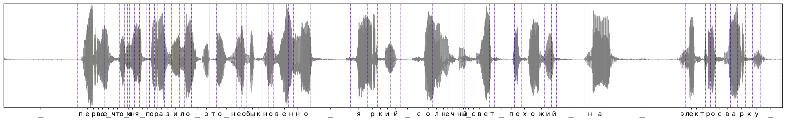
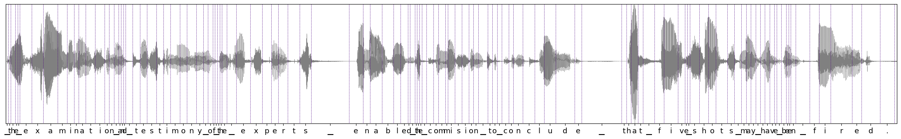

# UnitY2 forced alignment extractor

Please refer to Section 3.3.2 of the "Seamless: Multilingual Expressive and Streaming Speech Translation" paper to read more details about aligner design & training.

We provide a light-weight wrapper to extract alignments between given text and acoustic unit sequences. Unit extractor is also available from the wrapper itself. 

## Alignment extractor codebase

The entire codebase is located in `/src/seamless_communication/models/aligner`. It is built using fairseq2 library. This time we release a mutlilingual (38 languages following SeamlessM4Tv2 target languages) checkpoint to load the alignment toolkit. This checkpoint corresponds to `nar_t2u_aligner` asset card.

## Usage examples

For large-scale alignment extraction offline unit extraction is preferred. Refer to `/src/seamless_communication/cli/m4t/audio_to_units` for more details on offline unit extraction.

**Alignment extractor initialization:**

```python
from seamless_communication.models.aligner.alignment_extractor import AlignmentExtractor
from fairseq2.typing import Device
import torch

extractor = AlignmentExtractor(
    aligner_model_name_or_card="nar_t2u_aligner",
    unit_extractor_model_name_or_card="xlsr2_1b_v2",
    unit_extractor_output_layer=35,
    unit_extractor_kmeans_model_uri="https://dl.fbaipublicfiles.com/seamlessM4T/models/unit_extraction/kmeans_10k.npy",
)
```
* large unit extractor checkpoint will be downloaded, this takes time

* by default cpu device is used, but fp16 (`dtype=torch.float16`) & cuda (`device=Device("cuda")`) are supported, see class constructor for details


**Extracting alignment**

Ru audio example:

* audio link: `https://models.silero.ai/denoise_models/sample0.wav` (thanks Silero team for public audio samples)

* ru_transcription: `первое что меня поразило это необыкновенно яркий солнечный свет похожий на электросварку`

```python
alignment_durations, _, tokenized_text_tokens = extractor.extract_alignment("sample0.wav", ru_transcription, plot=True, add_trailing_silence=True)
```
* audio will be resampled to 16kHz for unit extraction

* `alignment_durations` contains number of units (20ms frames) aligned per each token from `tokenized_text_tokens`.

* `add_trailing_silence` sets extra silence token in the end of the given text sequence. That is useful when there is no terminal punctuation provided in the text itself.

Ru alignment plot:


En audio example: 

* audio link: `https://dl.fbaipublicfiles.com/seamlessM4T/LJ037-0171_sr16k.wav`

* en_transcription: `the examination and testimony of the experts enabled the commision to conclude that five shots may have been fired.`

```python
alignment_durations, _, tokenized_text_tokens = extractor.extract_alignment("LJ037-0171_sr16k.wav", en_transcription, plot=True, add_trailing_silence=False)
```
* here we set `add_trailing_silence` to False since terminal punctuation exists, but True will also work

En alignment plot:


## Integration test

If you encounter issues with produced alignments, please run integration test with the alignment extraction toolkit to make sure that your environment works good.

Run from the repo root:

`pytest -vv tests/integration/models/test_unity2_aligner.py`
