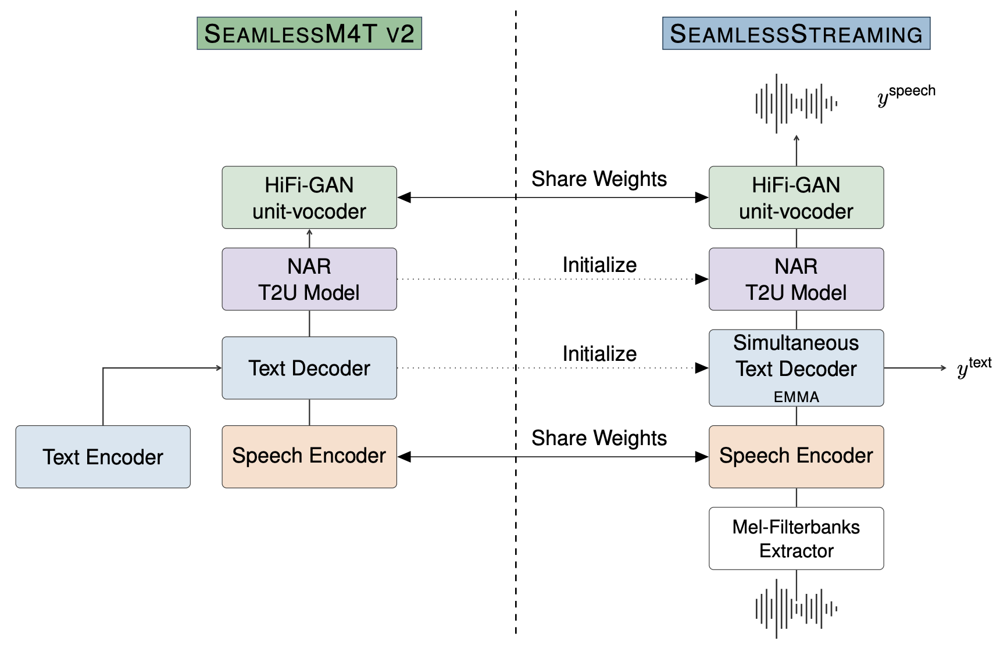

# SeamlessStreaming
SeamlessStreaming is a multilingual streaming translation model. It supports:

- Streaming Automatic Speech Recognition on 96 languages.
- Simultaneous translation on 101 source languages for speech input.
- Simultaneous translation on 96 target languages for text output.
- Simultaneous translation on 36 target languages for speech output.

Check out the SeamlessM4T [README](../m4t/README.md) for more details on supported languages.




## SeamlessStreaming  models
| Model Name         | #params | checkpoint                                                                              | metrics                                                                              |
| ------------------ | ------- | --------------------------------------------------------------------------------------- | ------------------------------------------------------------------------------------ |
| SeamlessStreaming  | 2.5B    | [🤗 Model card](https://huggingface.co/facebook/seamless-streaming) - [monotonic decoder checkpoint](https://huggingface.co/facebook/seamless-streaming/resolve/main/seamless_streaming_monotonic_decoder.pt) - [streaming UnitY2 checkpoint](https://huggingface.co/facebook/seamless-streaming/resolve/main/seamless_streaming_unity.pt)  | [metrics](https://dl.fbaipublicfiles.com/seamless/metrics/streaming/seamless_streaming.zip)  |

The evaluation data ids for FLEURS, CoVoST2 and CVSS-C can be found [here](https://dl.fbaipublicfiles.com/seamless/metrics/evaluation_data_ids.zip)


## Evaluating SeamlessStreaming models
To reproduce our results, or to evaluate using the same metrics over your own test sets, please check out the [Evaluation README here](../../src/seamless_communication/cli/streaming/README.md). Streaming evaluation depends on the SimulEval library.

## Citation

For EMMA, please cite :
```bibtex
@article{ma_efficient_2023,
  author={Ma, Xutai and Sun, Anna and Ouyang, Siqi and Inaguma, Hirofumi and Tomasello, Paden},
  title={Efficient Monotonic Multihead Attention},
  year={2023},
  url={https://ai.meta.com/research/publications/efficient-monotonic-multihead-attention/},
}
```

For SeamlessStreaming, please cite :
```bibtex
@inproceedings{seamless2023,
   title="Seamless: Multilingual Expressive and Streaming Speech Translation",
   author="{Seamless Communication}, Lo{\"i}c Barrault, Yu-An Chung, Mariano Coria Meglioli, David Dale, Ning Dong, Mark Duppenthaler, Paul-Ambroise Duquenne, Brian Ellis, Hady Elsahar, Justin Haaheim, John Hoffman, Min-Jae Hwang, Hirofumi Inaguma, Christopher Klaiber, Ilia Kulikov, Pengwei Li, Daniel Licht, Jean Maillard, Ruslan Mavlyutov, Alice Rakotoarison, Kaushik Ram Sadagopan, Abinesh Ramakrishnan, Tuan Tran, Guillaume Wenzek, Yilin Yang, Ethan Ye, Ivan Evtimov, Pierre Fernandez, Cynthia Gao, Prangthip Hansanti, Elahe Kalbassi, Amanda Kallet, Artyom Kozhevnikov, Gabriel Mejia, Robin San Roman, Christophe Touret, Corinne Wong, Carleigh Wood, Bokai Yu, Pierre Andrews, Can Balioglu, Peng-Jen Chen, Marta R. Costa-juss{\`a}, Maha Elbayad, Hongyu Gong, Francisco Guzm{\'a}n, Kevin Heffernan, Somya Jain, Justine Kao, Ann Lee, Xutai Ma, Alex Mourachko, Benjamin Peloquin, Juan Pino, Sravya Popuri, Christophe Ropers, Safiyyah Saleem, Holger Schwenk, Anna Sun, Paden Tomasello, Changhan Wang, Jeff Wang, Skyler Wang, Mary Williamson",
  journal={ArXiv},
  year={2023}
}
```

